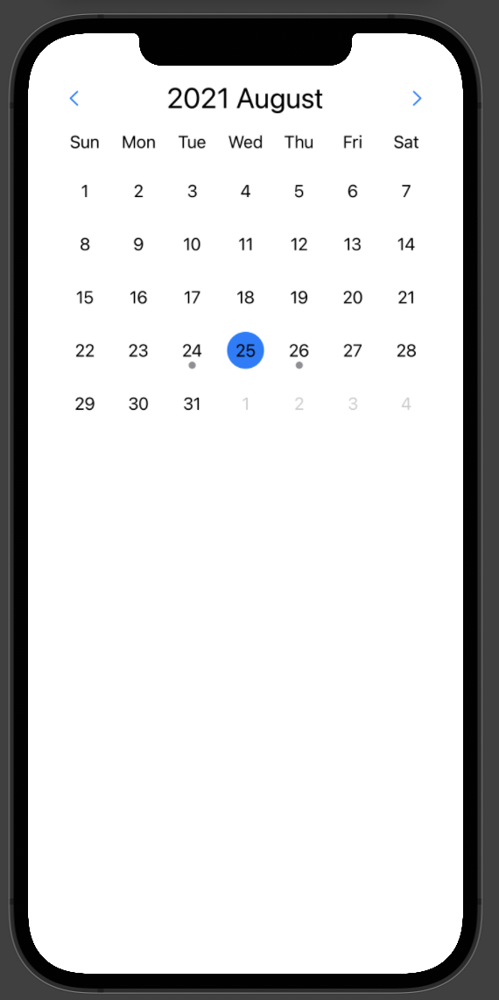
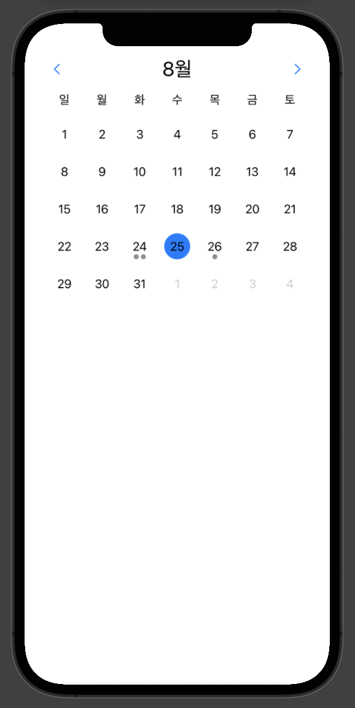
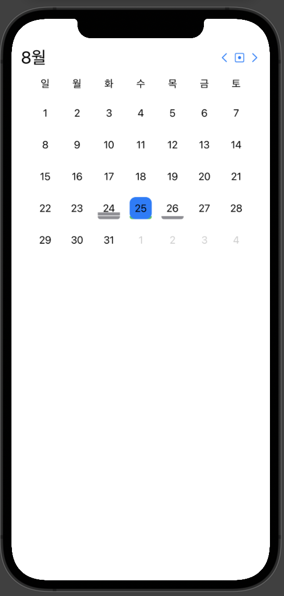
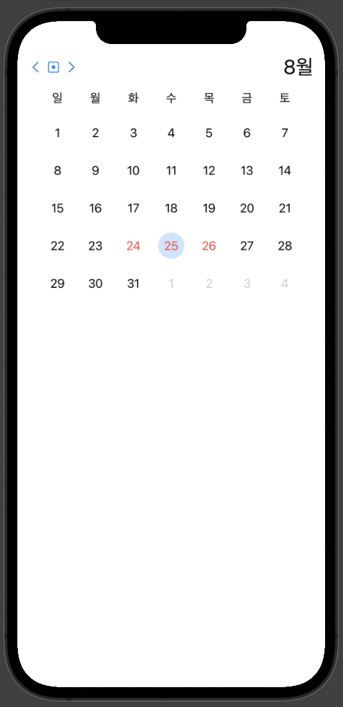
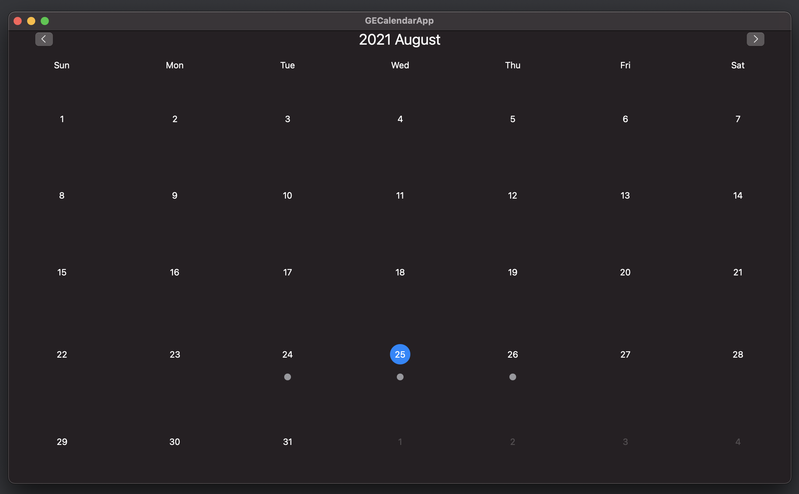
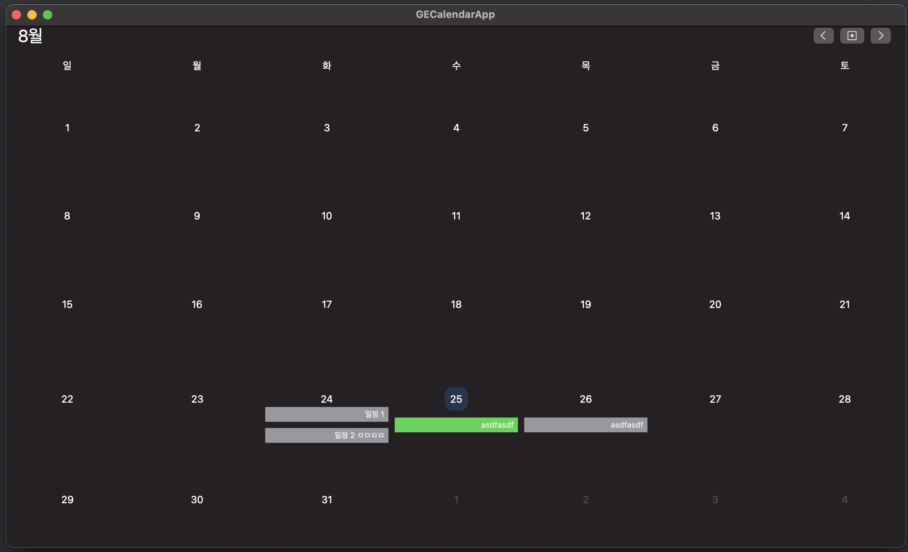
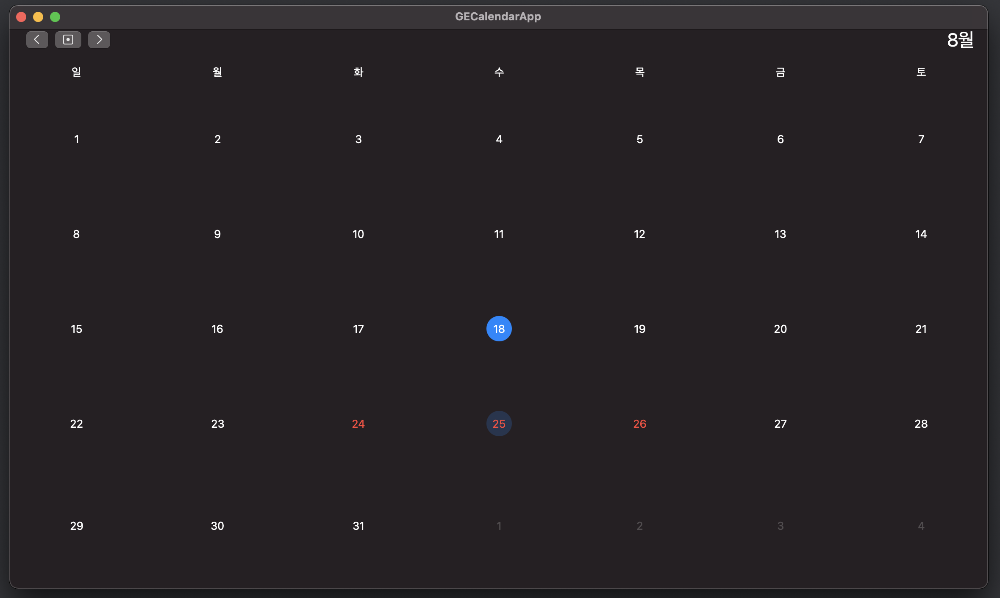
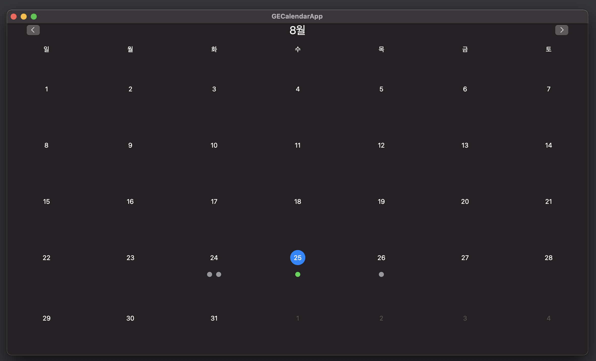

# GECalendar

[](https://cocoapods.org/pods/GECalendar)
[](https://cocoapods.org/pods/GECalendar)
[](https://cocoapods.org/pods/GECalendar)


SwiftUI iOS & MacOS Calendar

## Requirements

- iOS 14.0+, MacOS 11.0+
- Swift 5.0+

## Screenshots

| iOS                                                         |                                                           |                                                           |                                                            |
| ----------------------------------------------------------- | --------------------------------------------------------- | --------------------------------------------------------- | ---------------------------------------------------------- |
|  |  |  |  |

| macOS                                                       |                                                            |
| ----------------------------------------------------------- | ---------------------------------------------------------- |
|    |   |
|  |  |

You can look this views at the [GECalendarApp](https://github.com/Goeun1001/GECalendar/tree/master/Demo/GECalendarApp)'s GECalendarPreviews.

## Usage

```swift
struct ContentView: View {
    @State var date: Date? = Date()
    var body: some View {
        GECalendar(selectedDate: $date, appearance: Appearance())
    }
}
```

```swift
struct ContentView: View {
    @State var date: Date? = Date()
    var body: some View {
        GEWeekView(selectedDate: $date, appearance: Appearance())
    }
}
```

You can manage settings with GECalendar's [Appearance](https://github.com/Goeun1001/GECalendar/blob/master/Sources/GECalendar/Shared/Appearance.swift).

## Installation

### CocoaPods

```
pod 'GECalendar'
```

### Carthage

```
github "Goeun1001/GECalendar"
```

### SPM

```
.package(url: "https://github.com/Goeun1001/GECalendar.git", from: "1.0.0")
```

## Author

goeun1001, [gogo8272@gmail.com](mailto:gogo8272@gmail.com)

## License

GECalendar is available under the MIT license. See the LICENSE file for more info.

## Reference

- Started from [Building calendar without UICollectionView in SwiftUI](https://swiftwithmajid.com/2020/05/06/building-calendar-without-uicollectionview-in-swiftui/)
